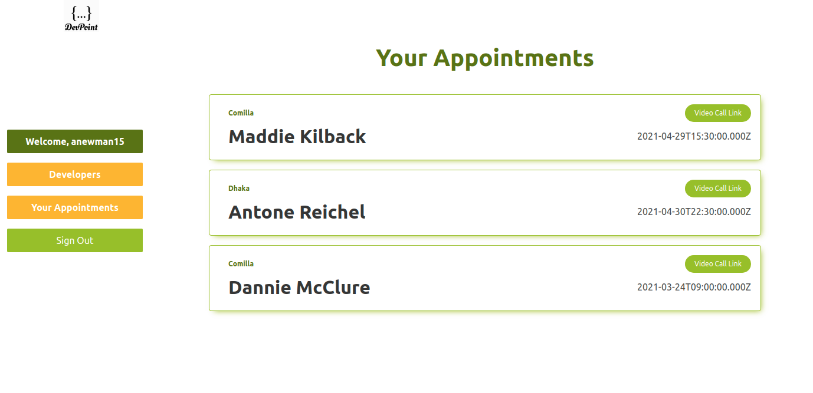

# DevPoint - Set an Appointment with a Developer
A site that allows hiring managers find niche developers. Built with Rails/React/Redux

## App Screenshot


## Built With

* Ruby v 2.7.1
* Rails v 6.0.3.3
* Devise
* PostgreSQL
* Jbuilder
* React
* Redux

## Live Version
Live on [Heroku](https://anewman15-deve-point.herokuapp.com/)

## Deployment

### Getting Started

1. Navigate to a directory of your choice and get a local copy from [this repo](https://github.com/anewman15/dev-point/)
2. `cd` into your cloned folder.

### Setup

Install gems with:

```
bundle install
```

Setup database with:

```
   rails db:create
   rails db:migrate
```

### Usage

Start server with:

```
    rails server
```

1. Open `http://localhost:3000/` in your browser


## Author
👤 **Abdullah Numan**

- Github:   https://github.com/anewman15
- Twitter:  https://twitter.com/aanuman15
- Linkedin: https://www.linkedin.com/in/aanuman15/
- Email:    anewman15@hotmail.com

## 🤝 Contributing

Contributions, issues and feature requests are welcome!

Feel free to check the [issues page](https://github.com/anewman15/dev-point/issues/).

## Show your support

Give a ⭐️ if you like this project!


## Acknowledgments

- https://www.microverse.org/
- https://www.theodinproject.com/
- https://guides.rubyonrails.org/
- https://www.stackoverflow.com/
